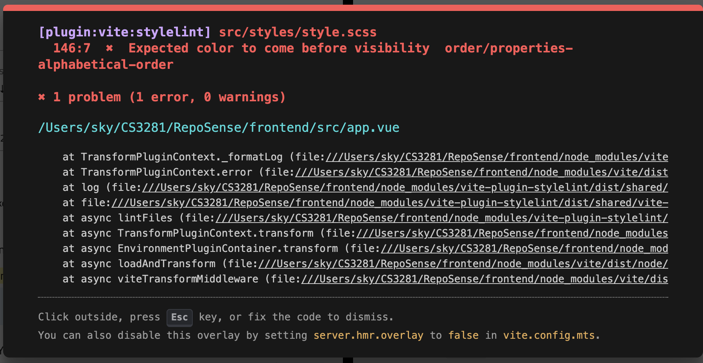

## Project Knowledge
[RepoSense](RepoSense.md)

### Vue.js

resources Used:
- [Vue mastery](https://www.vuemastery.com/courses/intro-to-vue-3/intro-to-vue3/): complete 11 lessons to create a basic shopping cart frontend.
- [Vue.js documentation](https://vuejs.org/guide/quick-start/)
<!-- List the aspects you learned, and the resources you used to learn them, and a brief summary of each resource. -->

```vue
.zoom__day(v-for="day in selectedCommits", :key="day.date")
```

the `:key` attribute is a special directive used by Vue.js (which is being rendered by Pug) to uniquely identify each element in a looped list. It tells Vue which elements have changed, been added, or removed, allowing it to accurately update the DOM.

| Term | Explanation |
|---------|-------------|
| `v-for` | A Vue.js directive used to render a list of items by iterating over an array or object. |
| `:key` | `:` is shorthand for `v-bind`, which binds the value of the attribute to a JavaScript expression. In this case, it binds the `key` attribute to dynamic variable `day.date`. |


### Pug

Pug's parser is misinterpreting where the attribute value ends when you split it across lines.
e.g.
```pug
:class="{warn: user.name === '-',
    'active-text': ...}"
```
The parser gets confused by the line break and the quote positioning. It's a quirk of how Pug tokenizes/parses attributes across multiple lines.

In pug, indentation defines parent-child relationships:
```pug
tooltip
  a.message-title        // child of tooltip
    .within-border       // child of a
  span.tooltip-text      // child of tooltip (sibling of a)
```

How does `tooltip` component know about `tooltip-text`? In `style.css`, we have:

```css
  &:hover {
    .tooltip-text {
      opacity: 1;
      visibility: visible;
    }
  }
```

### HTML

| Tag | Explanation |
|---------|-------------|
| `<span>` | The `<span>` tag is an **inline container** used to mark up a part of a text |

## DevOps

### GitHub Action workflow

Can set condition to only runs if:
  - Push to `master` branch, OR
  - Scheduled trigger (if enabled)

Does NOT run on pull requests (prevents deploying unreviewed changes)

```yml
deploy:
    needs: build
    if: (github.event_name == 'push' && github.ref == 'refs/heads/master') || github.event_name == 'schedule'
```

Summary of current github workflow:
- Push to master → Build report → Upload artifacts → Deploy to gh-pages → Live at GitHub Pages
- Pull request   → Build report → Upload artifacts → (stop, don't deploy)

### Gradle

Resources:
- [DPE](https://dpeuniversity.gradle.com/app)

### Hot Reloading

Can make changes to frontend code and see the updates in the browser *without needing to manually refresh the page*.



## AI in Development

### Gemini integration for Java
resources Used:
- [Gemini workshop for Java developers](https://github.com/glaforge/gemini-workshop-for-java-developers)
- [Offical Documentation: Gemini in Java with Vertex AI and LangChain4j](https://codelabs.developers.google.com/codelabs/gemini-java-developers)
- [Google Cloud](https://console.cloud.google.com/)

### Copilot
In-line chat: use `ctrl + shift + I` to open copilot chat window.

### Claude

Claude has this Claude Code, which can load folders from your local machine to its interface for code understanding and generation.

It also has a CLI tool.


